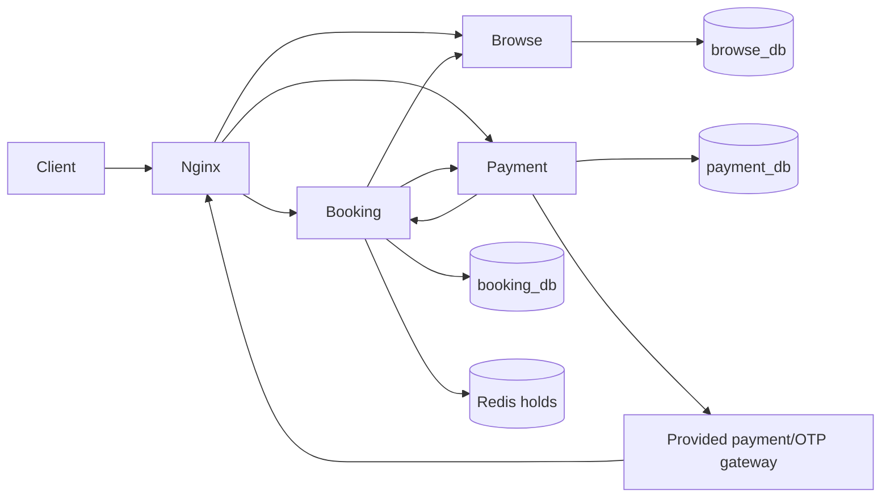

# CinemaSeat

Minimal FastAPI microservices for browsing cinema shows, holding a seat safely, and completing payment through the supplied gateway.

## Architecture



Temporary hold ownership is atomic in Redis. Confirmed seats have a unique `(showtime_id, seat_id)` constraint in PostgreSQL. Duplicate payment callbacks are stored once by `event_id`.

All application images use multi-stage builds. Python services copy only their runtime virtual environments and application code into non-root final images; the web image copies only the compiled React assets into Nginx.

## Run locally

Requirements: Docker with Docker Compose.

```bash
docker compose up --build
```

The web app and public API are available at `http://localhost:8080`. The supplied gateway is exposed at `http://localhost:9000` by default; set `GATEWAY_PORT` if that port is occupied.

```bash
curl http://localhost:8080/health
curl http://localhost:8080/api/v1/movies
curl http://localhost:8080/api/v1/showtimes
```

## Frontend connection

Nginx serves the static frontend and proxies its same-origin `/api/v1` requests to the Browse, Booking, and Payment services. The browser therefore needs no separate API URL or CORS configuration.

The frontend is a React application built with Vite. When the backend is already running on port 8080, run it in development mode with:

```bash
cd frontend
npm ci
npm run dev
```

Open `http://localhost:4173`. Vite forwards `/api/v1` requests to `http://localhost:8080`. The production Docker build compiles the React application and copies it into the Nginx image.

The connected booking flow is:

1. Load movies, theatres, and showtimes from the Browse service.
2. Load seats and create a temporary hold through the Booking service.
3. Send and verify the OTP through the Payment service.
4. Start payment through the Booking service and poll the booking until it is confirmed.

## Exact judging requests

Fetch the seat map:

```bash
curl http://localhost:8080/api/v1/showtimes/1/seats
```

Hold a seat:

```bash
curl -i -X POST http://localhost:8080/api/v1/holds \
  -H "Content-Type: application/json" \
  -d '{"showtime_id":1,"seat_id":1,"user_ref":"user-001"}'
```

The successful request returns `201`; competing requests return `409`. Keep the returned `booking_ref`, `hold_id`, and `hold_token`.

Cancel a hold:

```bash
curl -i -X DELETE http://localhost:8080/api/v1/holds/HOLD_ID \
  -H "X-Hold-Token: HOLD_TOKEN"
```

Send and verify OTP:

```bash
curl -X POST http://localhost:8080/api/v1/otp/send \
  -H "Content-Type: application/json" \
  -d '{"booking_ref":"BOOKING_REF","phone":"01700000000"}'

curl -X POST http://localhost:8080/api/v1/otp/verify \
  -H "Content-Type: application/json" \
  -d '{"booking_ref":"BOOKING_REF","code":"OTP_CODE"}'
```

Start asynchronous payment:

```bash
curl -i -X POST http://localhost:8080/api/v1/bookings/BOOKING_REF/pay \
  -H "X-Mock-Mode: deterministic"
```

Check booking state:

```bash
curl http://localhost:8080/api/v1/bookings/BOOKING_REF
```

## Tests

Service unit tests:

```bash
cd services/browse && python -m pytest
cd services/booking && python -m pytest
cd services/payment && python -m pytest
```

Integration test with a short hold TTL:

```bash
HOLD_TTL_SECONDS=2 docker compose up --build -d
pip install -r requirements-dev.txt
pytest tests/integration
```

The integration test sends 100 concurrent requests for one seat and requires exactly one winner and zero oversells.

## CI/CD

CI tests all backend services, builds the React frontend, starts the Compose stack, and runs the application and gateway integration suites. After CI succeeds on `main`, CD publishes four commit-tagged images to GHCR and deploys the exact tested commit to the production VM.

Follow the complete [GitHub, GHCR, VM, secrets, and branch-protection setup](docs/CI-CD.md).

## Configuration

Important variables are shown in `.env.example`. `HOLD_TTL_SECONDS` is never hardcoded. Replace the internal token and local database credentials for a public deployment.
