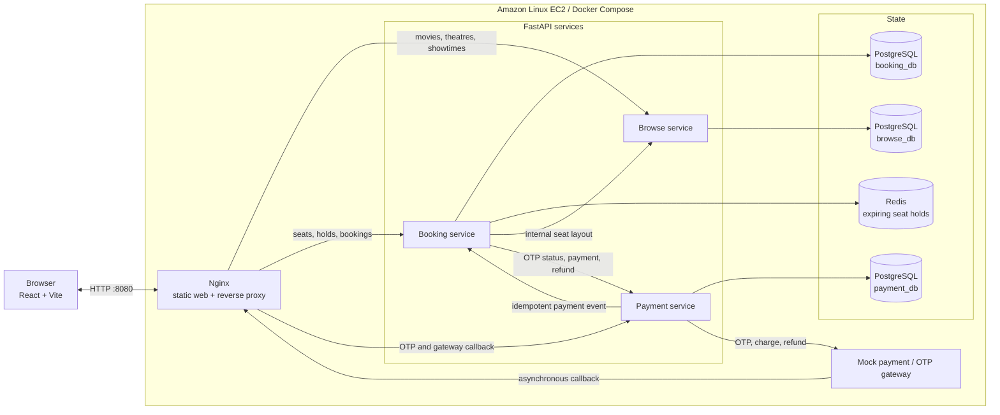
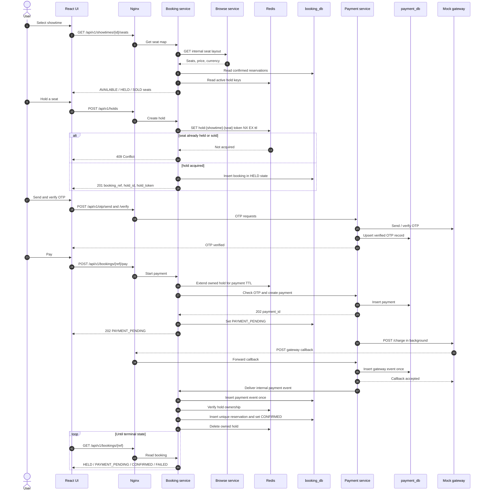
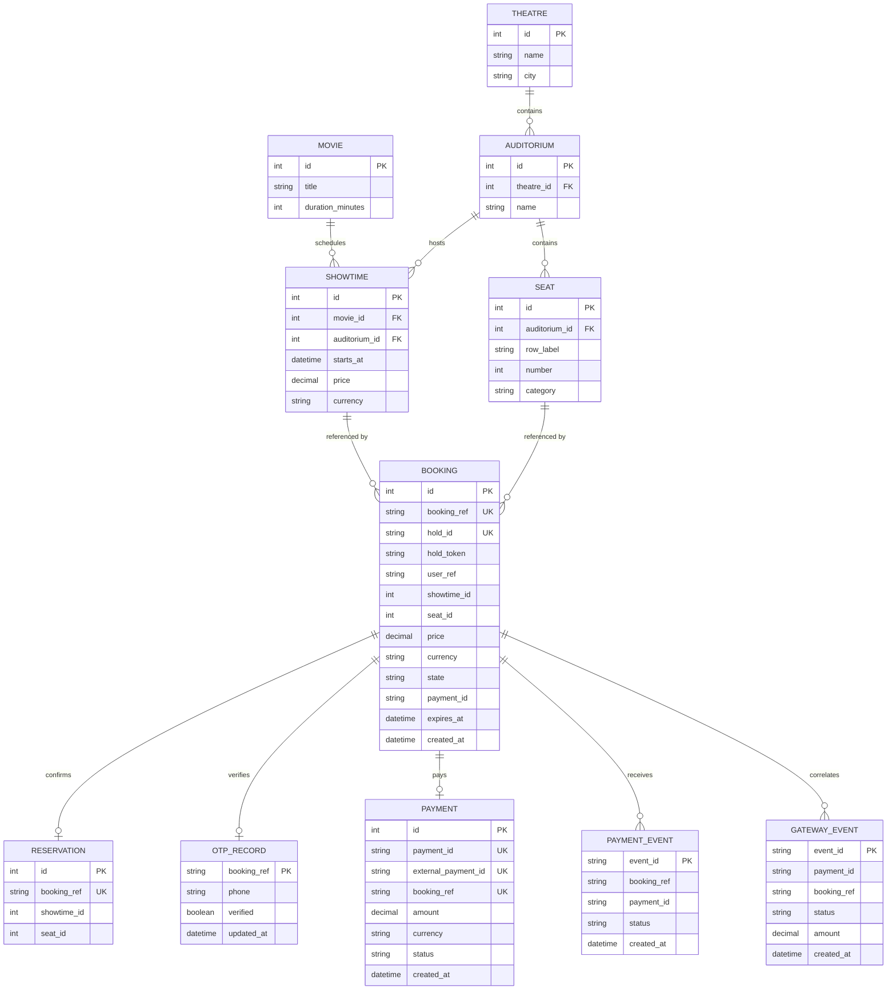
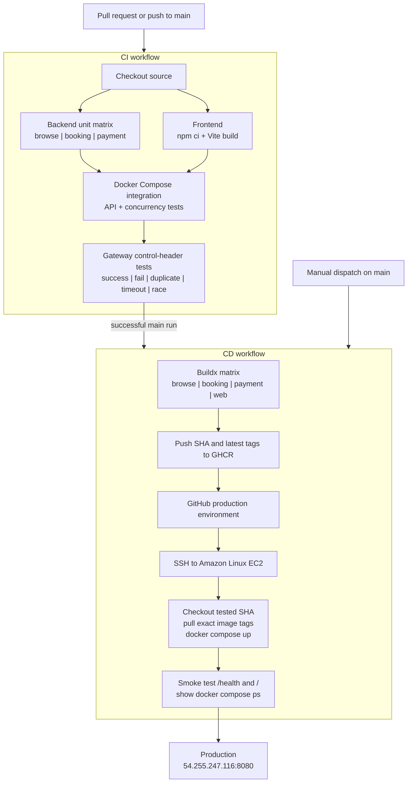

# CinemaSeat

Minimal FastAPI microservices for browsing cinema shows, holding a seat safely, and completing payment through the supplied gateway.
## 🎥 Project Demo

[](https://youtu.be/fh_w8TnPm-k)


## Live deployment

**Application:** [http://54.255.247.116:8080/](http://54.255.247.116:8080/)

**Health check:** [http://54.255.247.116:8080/health](http://54.255.247.116:8080/health)
**Yutube link:** [https://youtu.be/fh_w8TnPm-k]

The deployment runs on an Amazon Linux EC2 instance. Port `8080` must be allowed by the instance security group.

## Architecture diagram



### System design

| Component | Responsibility |
| --- | --- |
| React/Vite frontend | Presents movies, showtimes, seats, OTP, payment, and booking state. It uses same-origin `/api/v1` calls. |
| Nginx | Serves the compiled SPA, applies JavaScript/CSS MIME types and caching, exposes `/health`, and routes each API path to its owning service. |
| Browse service | Owns movie, theatre, auditorium, seat, and showtime catalogue data. |
| Booking service | Owns the booking state machine, atomic holds, confirmed reservations, and payment-event processing. |
| Payment service | Owns OTP verification, payment records, callback deduplication, and gateway integration. |
| PostgreSQL | Provides one logical database per service: `browse_db`, `booking_db`, and `payment_db`. |
| Redis | Uses `SET ... NX EX` for exclusive, expiring seat ownership and Lua scripts for token-safe extension/deletion. |
| Mock gateway | Simulates OTP, charge, callback, refund, failure, duplicate, timeout, and race scenarios. |

Key design properties:

- Nginx is the only public application entry point; service-to-service endpoints stay on the Compose network.
- Each service owns its data. IDs such as `booking_ref`, `showtime_id`, and `seat_id` are logical references across service boundaries rather than cross-database foreign keys.
- A Redis hold is temporary, while a PostgreSQL reservation is durable. The unique `(showtime_id, seat_id)` reservation constraint is the final oversell guard.
- Gateway and booking events are stored once by `event_id`, making duplicate callbacks safe.
- Payment callbacks can arrive before `/charge` returns. Terminal payment state is not overwritten by the later charge response.
- Internal booking/payment calls require `X-Internal-Token`. The gateway callback is public because the gateway must reach it through Nginx.
- The current implementation uses HTTP callbacks and background tasks; RabbitMQ is not part of this deployment.

All application images use multi-stage builds. Python services copy only their runtime virtual environments and application code into non-root final images; the web image copies only the compiled React assets into Nginx.

## Booking and payment sequence



## Data models

The diagram combines the three logical databases for readability. Solid relationships inside `browse_db` are database foreign keys; relationships crossing service ownership are correlated by IDs in application code.



Important constraints are the unique auditorium seat label `(auditorium_id, row_label, number)`, unique confirmed seat `(showtime_id, seat_id)`, unique `booking_ref` per payment, and primary-key `event_id` deduplication in both event tables.

## How to run

### Prerequisites

- Git
- Docker Engine or Docker Desktop with Docker Compose v2
- At least 2 GB of free memory for the complete stack
- Node.js 22 only when running the frontend in development mode

Confirm Docker and Compose are available:

```bash
docker --version
docker compose version
```

### Run the complete application with Docker

1. Clone the repository and enter it:

   ```bash
   git clone https://github.com/stabbed-Yuri/CinemaSeat.git
   cd CinemaSeat
   ```

2. Create the local environment file:

   ```bash
   cp .env.example .env
   ```

   On Windows PowerShell, use `Copy-Item .env.example .env`. The example values work for local development. Replace `INTERNAL_SERVICE_TOKEN` with a strong random value before using the stack on a public server.

3. Build and start every service:

   ```bash
   docker compose up --build -d
   ```

   The first run can take several minutes while Docker downloads the base images and builds the four application images. PostgreSQL automatically creates `browse_db`, `booking_db`, and `payment_db`.

4. Check container health:

   ```bash
   docker compose ps
   curl http://localhost:8080/health
   ```

5. Open [http://localhost:8080](http://localhost:8080) in a browser.

Useful API checks:

```bash
curl http://localhost:8080/api/v1/movies
curl http://localhost:8080/api/v1/theatres
curl http://localhost:8080/api/v1/showtimes
```

The application and public API use port `8080`. The mock gateway uses port `9000`; set `GATEWAY_PORT` in `.env` if port `9000` is already occupied.

### View logs and restart

Follow logs from the public proxy and application services:

```bash
docker compose logs -f nginx browse booking payment
```

Rebuild and restart after changing application code:

```bash
docker compose up --build -d
```

Stop the application while retaining PostgreSQL and Redis data:

```bash
docker compose down
```

To perform a completely clean local reset, remove the containers and named data volumes, then start again:

```bash
docker compose down -v
docker compose up --build -d
```

`docker compose down -v` permanently deletes the local CinemaSeat database and Redis data.

### Frontend development mode

Nginx serves the static frontend and proxies its same-origin `/api/v1` requests to the Browse, Booking, and Payment services. The browser therefore needs no separate API URL or CORS configuration.

Keep the Docker stack running on port `8080`, then start the Vite development server in a second terminal:

```bash
cd frontend
npm ci
npm run dev
```

Open `http://localhost:4173`. Vite forwards `/api/v1` requests to `http://localhost:8080`. The production Docker build compiles the React application and copies it into the Nginx image.

If the backend is running at a different address, set `API_PROXY_URL` before starting Vite:

```bash
API_PROXY_URL=http://localhost:8080 npm run dev
```

PowerShell equivalent:

```powershell
$env:API_PROXY_URL = "http://localhost:8080"
npm run dev
```

The connected booking flow is:

1. Load movies, theatres, and showtimes from the Browse service.
2. Load seats and create a temporary hold through the Booking service.
3. Send and verify the OTP through the Payment service.
4. Start payment through the Booking service and poll the booking until it is confirmed.

## Exact judging requests

Fetch the seat map:

```bash
curl http://localhost:8080/api/v1/showtimes/1/seats
```

Hold a seat:

```bash
curl -i -X POST http://localhost:8080/api/v1/holds \
  -H "Content-Type: application/json" \
  -d '{"showtime_id":1,"seat_id":1,"user_ref":"user-001"}'
```

The successful request returns `201`; competing requests return `409`. Keep the returned `booking_ref`, `hold_id`, and `hold_token`.

Cancel a hold:

```bash
curl -i -X DELETE http://localhost:8080/api/v1/holds/HOLD_ID \
  -H "X-Hold-Token: HOLD_TOKEN"
```

Send and verify OTP:

```bash
curl -X POST http://localhost:8080/api/v1/otp/send \
  -H "Content-Type: application/json" \
  -d '{"booking_ref":"BOOKING_REF","phone":"01700000000"}'

curl -X POST http://localhost:8080/api/v1/otp/verify \
  -H "Content-Type: application/json" \
  -d '{"booking_ref":"BOOKING_REF","code":"OTP_CODE"}'
```

Start asynchronous payment:

```bash
curl -i -X POST http://localhost:8080/api/v1/bookings/BOOKING_REF/pay \
  -H "X-Mock-Mode: deterministic"
```

Check booking state:

```bash
curl http://localhost:8080/api/v1/bookings/BOOKING_REF
```

## Tests

Service unit tests:

```bash
cd services/browse && python -m pytest
cd services/booking && python -m pytest
cd services/payment && python -m pytest
```

Integration test with a short hold TTL:

```bash
HOLD_TTL_SECONDS=2 docker compose up --build -d
pip install -r requirements-dev.txt
pytest tests/integration
```

The integration test sends 100 concurrent requests for one seat and requires exactly one winner and zero oversells.

## CI/CD

CI tests all backend services, builds the React frontend, starts the Compose stack, and runs the application and gateway integration suites. After CI succeeds on `main`, CD publishes four commit-tagged images to GHCR and deploys the exact tested commit to the production VM.

### Workflow pipelines



The CD workflow is serialized with a production concurrency group. It deploys `${DEPLOY_SHA}` instead of an unpinned `latest` image, so the running release is the same commit that passed CI. GitHub Actions build cache is scoped per image, and the deploy job performs health checks before reporting success.

Follow the complete [GitHub, GHCR, VM, secrets, and branch-protection setup](docs/CI-CD.md).

## Configuration

Important variables are shown in `.env.example`. `HOLD_TTL_SECONDS` is never hardcoded. Replace the internal token and local database credentials for a public deployment.
